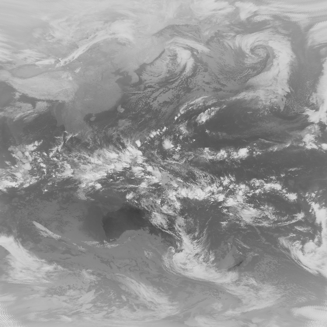

# INDEX
- [ABOUT](#ABOUT)
- [ENVIRONMENT](#ABOUT)
- [INSTALATION](#INSTALATION)
- [HOWTOUSE](#HOWTOUSE)

# ABOUT
- Download satelite data picture from [高知大学気象情報wiki](http://weather.is.kochi-u.ac.jp/sat/ALL/)
- SSSSYYMMDDHHCCC.pgm.gz: SSSS ... satelitename, YY ... 年(下2桁), MM ... month, DD ... day, HH ... hour(GMT), CCC ... [channel](https://www.data.jma.go.jp/mscweb/ja/info/spsg_ahi.html)




# ENVIRONMENT
I used the following environment.
- Python3.8
- Ubuntu 20.04 LTS or MacOS Catalina

I think these program can run in windows.But, I didn't test it.

# INSTALATION

## build from source cord.

```shell
git clone https://github.com/RyosukeDTomita/satelite-dl
cd satelite-dl
python3 setup.py install
```

## build from tar.gz

```shell
wget https://github.com/RyosukeDTomita/satelite-dl/blob/master/dist/satelite-dl-0.0.1.tar.gz
pip install satelite-dl-0.0.1.tar.gz
```

## check instlation is sucess

```
pip list | grep satelite-dl
satelite-dl                       0.0.1
```

# HOWTOUSE

## run from source cord
- default output dir is dirname(__file__)

```shell
python3 -m satelitedl --date 19990101 -o <output_dir_path> # daily data
python3 -m satelitedl --date 199901 -o <output_dir_path> # monthly data
python3 -m satelitedl --date 1999 -o <output_dir_path> # yearly data
```


## run from builded cord (see [INSTALATION](#INSTALATION))
- Need to install.
- default output dir is dirname(__file__)

```shell
satelite-dl --date 19990101 -o <output_dir_path>
```

## expand file

```shell
gunzip 2020/12/*/
```
